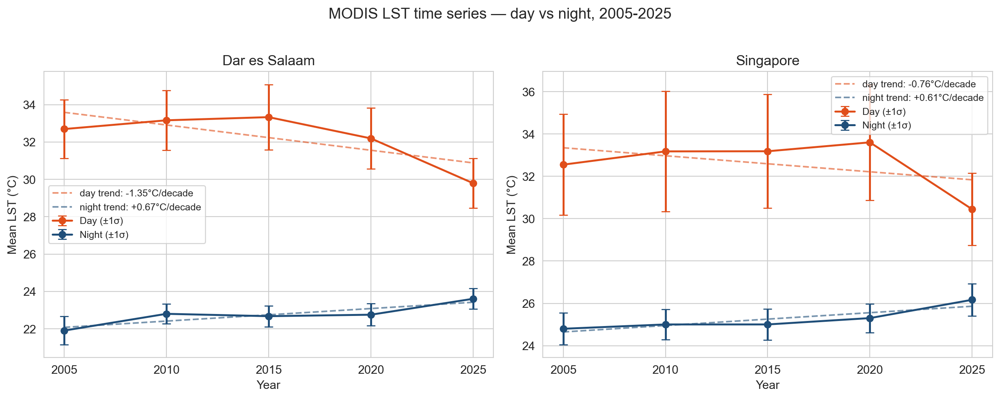
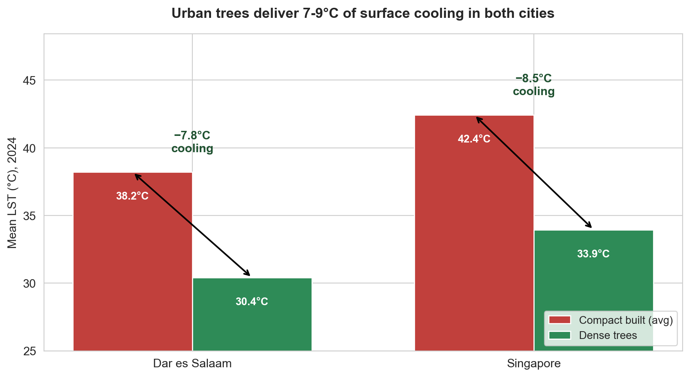
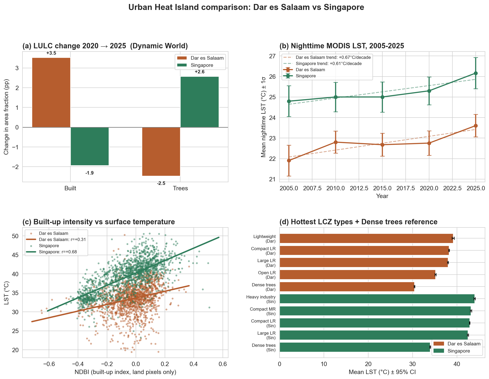
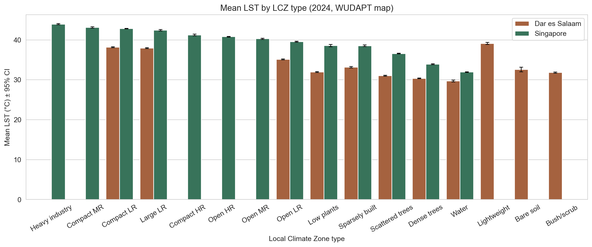
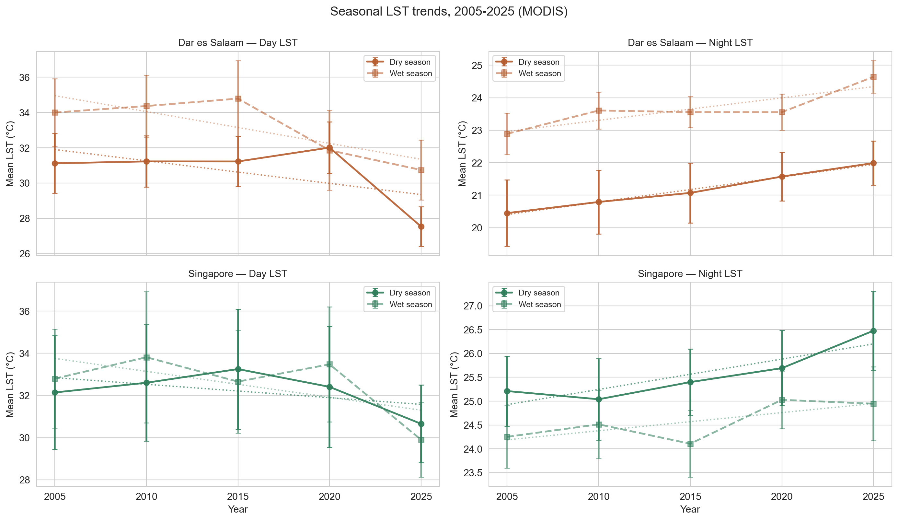

# Urban Heat Island: Dar es Salaam vs Singapore

> A comparative remote sensing analysis of Urban Heat Island (UHI) patterns in two contrasting tropical cities — Dar es Salaam (rapidly urbanizing, Global South) and Singapore (actively greening, Global North) — using 20 years of satellite thermal imagery, land cover data, and urban morphology classification.

[](https://www.python.org/)
[](https://earthengine.google.com/)
[](LICENSE)
[](https://www.womenandgirlsingis.org/)

---

## Table of Contents

- [Overview](#overview)
- [Key Findings](#key-findings)
- [Project Structure](#project-structure)
- [Notebooks](#notebooks)
- [Data Sources](#data-sources)
- [Installation](#installation)
- [Reproducibility](#reproducibility)
- [Results Summary](#results-summary)
- [Limitations](#limitations)
- [Team](#team)
- [References](#references)

---

## Overview

This project compares Urban Heat Island (UHI) dynamics in two tropical cities with opposite urban trajectories:

| | Dar es Salaam, Tanzania | Singapore |
|---|---|---|
| **Urban trajectory** | Rapidly expanding (informal growth) | Actively managed (green city policy) |
| **Built-up 2020** | 57.6% | 55.8% |
| **Built-up 2025** | 61.2% (**+3.5pp**) | 53.8% (**−1.9pp**) |
| **Tree cover 2020** | 16.7% | 26.6% |
| **Tree cover 2025** | 14.2% (**−2.5pp**) | 29.2% (**+2.6pp**) |

Dar is densifying and losing green cover. Singapore is doing the opposite. We test whether this divergence produces different UHI profiles.

### Research Questions

1. Do cities with opposite LULC trajectories show divergent UHI intensification?
2. Is nighttime warming detectable over a 20-year satellite record in both cities?
3. Which urban morphology types (LCZ classes) are hottest, and does this differ between a Global South and Global North city?
4. What is the quantified cooling benefit of urban tree cover?
5. Does seasonality modulate UHI differently in a semi-arid coastal city (Dar) vs an equatorial city (Singapore)?

---

## Key Findings

### 🌡️ Night warming is the robust signal — +0.6–0.8°C per decade

Both cities show statistically significant **nighttime** warming over 2005–2025:

| City | Season | Night trend | R² | p-value |
|---|---|---|---|---|
| Dar es Salaam | Dry | **+0.77°C/decade** | 0.990 | < 0.001 |
| Singapore | Dry | **+0.64°C/decade** | 0.794 | 0.042 |

Day LST trends were not statistically significant (p > 0.25 for all combinations), partly reflecting MODIS 2025 data artifacts from La Niña.

### 🏙️ Urban form shapes thermal exposure differently in each city

The hottest Local Climate Zone differs by city:

| City | Hottest LCZ | Mean LST | Coolest LCZ | Mean LST | Intra-city range |
|---|---|---|---|---|---|
| Dar es Salaam | **Lightweight LR** (informal settlements) | 39.1°C | Water | 29.7°C | **9.4°C** |
| Singapore | **Heavy industry** | 44.0°C | Water | 31.9°C | **12.0°C** |

**Dar's informal settlements (corrugated-iron roofed structures, LCZ 7) are the hottest urban form in the city** — a climate-justice finding that concentrates heat exposure on lower-income communities.

### 🌳 Dense urban trees cool both cities by 7–9°C

Despite totally different urban morphologies and climates:

| City | Compact built mean LST | Dense trees mean LST | Cooling benefit |
|---|---|---|---|
| Dar es Salaam | 38.2°C | 30.4°C | **−7.8°C** |
| Singapore | 42.4°C | 33.9°C | **−8.5°C** |

This near-identical cooling benefit across two very different cities suggests a **robust, transferable tropical urban greening policy target**.

### 📊 Built-up density predicts surface temperature (land pixels, 2024)

| City | NDVI–LST r | NDBI–LST r | n pixels |
|---|---|---|---|
| Dar es Salaam | −0.44 | +0.31 | 3,211 |
| Singapore | **−0.62** | **+0.68** | 4,939 |

Singapore's stronger NDBI signal reflects its high-rise glass-and-concrete morphology, which produces strong spectral built-up signatures. Dar's weaker NDBI signal reflects informal settlement materials (corrugated iron, mud) that are spectrally less distinct from bare soil — a methodological finding about the limits of Global-North-calibrated indices in Global South contexts.

### 🌦️ Dar's "wet" transitional months are hotter than its dry season

Counter-intuitively, Dar's wettest transitional months (March–May, November–December) are on average **2.5°C warmer** than the long dry season (June–October), consistent with East African climatology where the SE monsoon brings cooler Indian Ocean air to the coast Jun–Oct.

Singapore shows near-zero seasonality (< 1°C dry–wet contrast) as expected for an equatorial city.

### 📡 Satellite LST–station bias: +10.6°C (physically expected)

Singapore NEA station validation (9 land stations, 2024) shows Landsat LST is **+10.6°C warmer than 2m air temperature** on average, consistent with the physical distinction between radiant surface skin temperature (measured by satellite at ~10:30am overpass) and ambient air temperature. The hottest LST–SAT differentials occur at urban industrial sites (+14.9°C at Paya Lebar) and smallest at vegetated island sites (+7.5°C at Sentosa), spatially confirming the urban heat mechanism.

---

## Project Structure

```
uhi-dar-singapore/
├── README.md
├── requirements.txt
├── .gitignore
│
├── data/
│   ├── raw/                          # GEE exports (gitignored, regenerate via notebooks)
│   ├── processed/                    # Cleaned CSVs
│   └── aoi/                          # Boundary shapefiles / GeoJSON
│
├── notebooks/
│   ├── 01_lulc_dynamic_world.ipynb      # LULC composition and change 2020→2025
│   ├── 02_lst_modis.ipynb               # Baseline LST snapshot (teammate notebook)
│   ├── 03_lst_day_night_timeseries.ipynb  # 20-year day+night LST trends
│   ├── 04_spectral_indices_correlation.ipynb  # Original (see 04b for patched)
│   ├── 04b_spectral_indices_patched.ipynb     # NDVI/NDBI/MNDWI vs LST (final)
│   ├── 05_lcz_classification.ipynb      # WUDAPT LCZ × LST analysis
│   ├── 06_synthesis_poster_figures.ipynb  # Poster figures and headline table
│   ├── 07_seasonal_breakdown.ipynb      # Dry vs wet season analysis
│   └── 08_station_validation.ipynb      # Singapore NEA station validation
│
├── src/
│   ├── __init__.py
│   ├── gee_helpers.py               # GEE init and shared utilities
│   ├── indices.py                   # NDVI/NDBI/MNDWI computation helpers
│   ├── stats.py                     # UHI intensity, UTFVI, correlation
│   └── viz.py                       # Plotting utilities
│
├── outputs/
│   ├── figures/                     # All generated PNGs
│   │   ├── 03_lst_timeseries.png
│   │   ├── 03_diurnal_range.png
│   │   ├── 04b_indices_vs_lst.png
│   │   ├── 04b_lst_per_class.png
│   │   ├── 05_lst_per_lcz.png
│   │   ├── 06_poster_dashboard.png
│   │   ├── 06_cooling_benefit.png
│   │   ├── 06_two_cities_story.png
│   │   ├── 07_seasonal_timeseries.png
│   │   ├── 07_seasonal_contrast.png
│   │   ├── 07_lcz_seasonal_contrast.png
│   │   └── 08_validation_sat_vs_lst.png
│   └── tables/                      # All generated CSVs
│
├── docs/
│   ├── methodology.md
│   ├── references.md
│   └── meeting_notes/
│
└── reference/
    └── siswanto_2023_jakarta.pdf    # Base methodology paper
```

---

## Notebooks

| # | Notebook | Purpose | New GEE calls | Runtime |
|---|---|---|---|---|
| 01 | `01_lulc_dynamic_world.ipynb` | Dynamic World LULC composition 2020 vs 2025 | Yes | ~10 min |
| 02 | `02_lst_modis.ipynb` | Baseline MODIS LST snapshot (teammate baseline) | Yes | ~5 min |
| 03 | `03_lst_day_night_timeseries.ipynb` | Day + night MODIS LST, 2005–2025 trend | Yes | ~5 min |
| 04b | `04b_spectral_indices_patched.ipynb` | NDVI / NDBI / MNDWI × LST correlation | Yes | ~5 min |
| 05 | `05_lcz_classification.ipynb` | WUDAPT LCZ map + LST per LCZ type | Yes | ~5 min |
| 06 | `06_synthesis_poster_figures.ipynb` | All poster figures + headline numbers | **No** | ~30 sec |
| 07 | `07_seasonal_breakdown.ipynb` | Dry vs wet season LST trends + LCZ seasonality | Yes | ~10 min |
| 08 | `08_station_validation.ipynb` | Singapore NEA station vs Landsat LST validation | Yes + API | ~3 min |

Run in order 01 → 08. Each notebook reads CSVs produced by previous ones; skipping breaks dependencies.

---

## Data Sources

| Dataset | Provider | Resolution | Years | Access |
|---|---|---|---|---|
| Dynamic World V1 | Google / Sentinel-2 | 10 m | 2020, 2025 | [GEE](https://developers.google.com/earth-engine/datasets/catalog/GOOGLE_DYNAMICWORLD_V1) |
| MODIS MOD11A2 LST | NASA Terra | 1 km | 2005–2025 | [GEE](https://developers.google.com/earth-engine/datasets/catalog/MODIS_061_MOD11A2) |
| Landsat 8/9 Collection 2 L2 | USGS | 30 m | 2024 | [GEE](https://developers.google.com/earth-engine/datasets/catalog/landsat) |
| Global LCZ Map | Demuzere et al. 2022 / WUDAPT | 100 m | ~2020 | [GEE: RUB/RUBCLIM/LCZ](https://gee-community-catalog.org/projects/global_lcz/) |
| GAUL 2024 Boundaries | FAO / sat-io | Vector | 2024 | [GEE sat-io](https://samapriya.github.io/awesome-gee-community-datasets/) |
| Singapore NEA Air Temperature | Singapore Government | Station | 2024 | [data.gov.sg API](https://api.data.gov.sg/v1/environment/air-temperature) |

> **Data access note:** Tanzania Meteorological Authority (TMA) station data is not freely available. Equivalent ground-truth validation could not be performed for Dar es Salaam — a known limitation of remote sensing research in Global South cities.

---

## Installation

### Prerequisites

- Python 3.11 (via [Miniconda](https://docs.conda.io/en/latest/miniconda.html))
- Google Earth Engine account — [register free](https://code.earthengine.google.com/)

### Step 1: Clone the repository

```bash
git clone https://github.com/YOUR-USERNAME/uhi-dar-singapore.git
cd uhi-dar-singapore
```

### Step 2: Create the conda environment

```bash
conda create -n uhi python=3.11 -y
conda activate uhi
```

### Step 3: Install geospatial packages from conda-forge

```bash
conda install -c conda-forge --strict-channel-priority \
    geopandas rasterio gdal fiona shapely pyproj -y
```

### Step 4: Install remaining packages via pip

```bash
pip install earthengine-api geemap jupyter matplotlib seaborn \
    pandas numpy scikit-learn scipy ipykernel pymannkendall
```

### Step 5: Register Jupyter kernel

```bash
python -m ipykernel install --user --name uhi --display-name "Python (uhi)"
```

### Step 6: Authenticate Google Earth Engine

```bash
earthengine authenticate
```

A browser window will open — sign in with your Google account that has GEE access, then paste the token back into the terminal.

### Step 7: Update your GEE project ID

Open `src/gee_helpers.py` and replace the project ID:

```python
GEE_PROJECT = 'your-gee-project-id'  # replace with your project
```

Find your project ID at [code.earthengine.google.com](https://code.earthengine.google.com/) → gear icon → Project info.

### Step 8: Verify installation

```bash
python test_env.py
```

Expected output:
```
All imports OK
GEE initialized successfully
GEE round-trip test: 1
```

---

## Reproducibility

All analysis runs entirely on Google Earth Engine's cloud — no large raster downloads are required. The notebooks are designed to be run top-to-bottom; intermediate results are saved as CSVs in `outputs/tables/` and read by later notebooks.

### Exact reproducibility notes

- **2025 MODIS data** — 2025 composites may differ slightly as GEE continues ingesting new scenes. For exact reproduction, pin the end date to `2025-06-01`.
- **Dynamic World mode composites** — use `.reduce(ee.Reducer.mode())` on annual collections; exact pixel values depend on which scenes are in the collection at time of computation.
- **Random seeds** — all `stratifiedSample()` and `sample()` calls use `seed=42` or `seed=7` for reproducibility.
- **WUDAPT LCZ map** — uses the `latest` tag; pin to a specific version for exact reproducibility: `RUB/RUBCLIM/LCZ/global_lcz_map/v1`.

---

## Results Summary

### Figure Gallery

| Figure | Description |
|---|---|
|  | 20-year MODIS LST day + night trends, 2005–2025 |
|  | Urban tree cooling benefit: −7.8°C (Dar), −8.5°C (Singapore) |
|  | Full project synthesis: LULC, trend, correlation, LCZ |
|  | Mean LST per Local Climate Zone type, both cities |
|  | Seasonal LST breakdown: dry vs wet |

### Headline Numbers at a Glance

```
━━━━━━━━━━━━━━━━━━━━━━━━━━━━━━━━━━━━━━━━━━━━━━━━━━━━━━━━━━━━━━━━━
                      DAR ES SALAAM        SINGAPORE
━━━━━━━━━━━━━━━━━━━━━━━━━━━━━━━━━━━━━━━━━━━━━━━━━━━━━━━━━━━━━━━━━
Built-up 2020→2025    57.6% → 61.2%       55.8% → 53.8%
Tree cover 2020→2025  16.7% → 14.2%       26.6% → 29.2%
Night warming trend   +0.77°C/decade *    +0.64°C/decade *
Hottest LCZ           Lightweight LR      Heavy industry
                      (informal settl.)
Hottest LST           39.1°C              44.0°C
Intra-city range      9.4°C               12.0°C
Tree cooling benefit  −7.8°C              −8.5°C
NDBI–LST r (land)     +0.31               +0.68
━━━━━━━━━━━━━━━━━━━━━━━━━━━━━━━━━━━━━━━━━━━━━━━━━━━━━━━━━━━━━━━━━
* p < 0.05, dry-season night LST, 2005–2025
```

---

## Limitations

1. **Five temporal snapshots only** — MODIS trends are fitted on 5 data points (2005, 2010, 2015, 2020, 2025). Annual data would give more robust trend estimates.

2. **2025 day LST anomaly** — Daytime LST drops sharply in 2025 for both cities. This likely reflects La Niña conditions (2024–25) and possible incomplete 2025 MODIS ingestion. Day trends are reported but flagged as non-significant artifacts; night trends are the primary result.

3. **Resolution mismatch** — MODIS (1 km) used for temporal trends; Landsat (30 m) used for spatial correlations. The two cannot be directly compared pixel-to-pixel.

4. **NDBI calibration** — NDBI was originally calibrated for temperate Global North cities. Its weaker performance in Dar (r = +0.31 vs +0.68 in Singapore) likely reflects the spectral properties of informal settlement materials (corrugated iron, unpainted concrete) that the index was not designed for.

5. **Dar station validation not possible** — Tanzania Meteorological Authority data is not freely accessible. Validation is Singapore-only.

6. **WUDAPT LCZ map vintage** — The global LCZ map reflects urban form circa 2020–2022. Rapid Dar expansion since 2022 may not be fully captured.

7. **Day-night comparison caution** — MODIS Terra daytime overpass is ~10:30am local, nighttime is ~10:30pm. These represent the daily temperature cycle at two specific points, not true maxima/minima.

---

## Team

This project was developed as part of the **Women + Girls in GIS Mentorship Programme** Legacy Project.

| Member |
|---|
| Sharon |
| Monalisa | 
| Aulia | 
| Parami | 


---

## License

This project is licensed under the MIT License — see [LICENSE](LICENSE) for details.

Data licences:
- MODIS: NASA open data policy
- Landsat: USGS open data policy
- Dynamic World: CC BY 4.0
- WUDAPT LCZ map: CC BY 4.0
- Singapore NEA data: Singapore Open Data Licence v1.0

---

*Built with Google Earth Engine · geemap · Landsat · MODIS · Dynamic World · WUDAPT*
