# Urban Heat Island: Dar es Salaam vs Singapore

> A comparative remote sensing analysis of Urban Heat Island (UHI) patterns in two contrasting tropical cities — Dar es Salaam (rapidly urbanizing, Global South) and Singapore (actively greening, Global North) — using 20 years of satellite thermal imagery, land cover data, and urban morphology classification.

[](https://www.python.org/)
[](https://earthengine.google.com/)
[](LICENSE)
[](https://www.womenandgirlsingis.org/)

---

## Table of Contents

- [Overview](#overview)
- [Key Findings](#key-findings)
- [Project Structure](#project-structure)
- [Notebooks](#notebooks)
- [Data Sources](#data-sources)
- [Installation](#installation)
- [Reproducibility](#reproducibility)
- [Results Summary](#results-summary)
- [Conclusion](#conclusion)
- [Limitations](#limitations)
- [Team](#team)
- [References](#references)

---

## Overview

This project compares Urban Heat Island (UHI) dynamics in two tropical cities with opposite urban trajectories:

| | Dar es Salaam, Tanzania | Singapore |
|---|---|---|
| **Urban trajectory** | Rapidly expanding (informal growth) | Actively managed (green city policy) |
| **Built-up 2020** | 57.73% | 54.57% |
| **Built-up 2025** | 61.52% (**+3.79pp**) | 53.69% (**−0.88pp**) |
| **Tree cover 2020** | 21.56% | 27.37% |
| **Tree cover 2025** | 18.48% (**−3.08pp**) | 29.95% (**+2.58pp**) |

Dar is densifying and losing green cover. Singapore is doing the opposite. We test whether this divergence produces different UHI profiles.

### Research Questions

1. Do cities with opposite LULC trajectories show divergent UHI intensification?
2. Is nighttime warming detectable over a 20-year satellite record in both cities?
3. Which urban morphology types (LCZ classes) are hottest, and does this differ between a Global South and Global North city?
4. What is the quantified cooling benefit of urban tree cover?
5. Does seasonality modulate UHI differently in a semi-arid coastal city (Dar) vs an equatorial city (Singapore)?

---

## Key Findings

### 🌡️ Night warming is the robust signal — +0.6–0.8°C per decade

Both cities show statistically significant **nighttime** warming over 2005–2025:

| City | Season | Night trend | R² | p-value |
|---|---|---|---|---|
| Dar es Salaam | Dry | **+0.77°C/decade** | 0.990 | < 0.001 |
| Singapore | Dry | **+0.64°C/decade** | 0.794 | 0.042 |

Day LST trends were not statistically significant (p > 0.25), partly reflecting La Niña 2024–25 conditions which temporarily suppressed daytime surface temperatures globally. Nighttime trends are the primary thermal signal.

### 🏙️ Urban form shapes thermal exposure differently in each city

| City | Hottest LCZ | Mean LST | Coolest LCZ | Mean LST | Intra-city range |
|---|---|---|---|---|---|
| Dar es Salaam | **Lightweight LR** (informal settlements) | 39.1°C | Water | 29.7°C | **9.4°C** |
| Singapore | **Heavy industry** | 44.0°C | Water | 31.9°C | **12.0°C** |

**Dar's informal settlements (LCZ 7) are the hottest urban form in the city** — a climate-justice finding that concentrates heat exposure on lower-income communities with least adaptive capacity.

### 🌳 Dense urban trees cool both cities by 7–9°C

| City | Compact built mean LST | Dense trees mean LST | Cooling benefit |
|---|---|---|---|
| Dar es Salaam | 38.2°C | 30.4°C | **−7.8°C** |
| Singapore | 42.4°C | 33.9°C | **−8.5°C** |

This near-identical cooling benefit across two very different cities suggests a **robust, transferable tropical urban greening policy target**.

### 📊 Built-up density predicts surface temperature (land pixels, 2024)

| City | NDVI–LST r | NDBI–LST r | n pixels |
|---|---|---|---|
| Dar es Salaam | −0.44 | +0.31 | 3,211 |
| Singapore | **−0.62** | **+0.68** | 4,939 |

Singapore's stronger NDBI signal reflects its high-rise glass-and-concrete morphology. Dar's weaker signal reflects informal settlement materials spectrally less distinct from bare soil — a methodological finding about Global-North-calibrated indices in Global South contexts.

### 🌦️ Dar's wet transitional months are hotter than its dry season

Dar's wet transitional months (March–May, November–December) are on average **2.5°C warmer** than the long dry season (June–October), consistent with East African climatology where the SE monsoon brings cooler Indian Ocean air Jun–Oct. Singapore shows near-zero seasonality (< 1°C dry–wet contrast) as expected for an equatorial city.

### 📡 Satellite LST–station bias: +10.6°C (physically expected)

Singapore NEA validation (9 land stations, 2024) shows Landsat LST is **+10.6°C warmer than 2m air temperature**, consistent with the physical distinction between radiant surface skin temperature at ~10:30am overpass and ambient air temperature. Hottest bias at industrial Paya Lebar (+14.9°C), smallest at vegetated Sentosa (+7.5°C).

---

## Project Structure

```
uhi-dar-singapore/
├── README.md
├── requirements.txt
├── .gitignore
│
├── data/
│   ├── raw/                          # GEE exports (gitignored)
│   ├── processed/                    # Cleaned CSVs
│   └── aoi/                          # Boundary shapefiles / GeoJSON
│
├── notebooks/
│   ├── 00_team_baseline_lulc_lst.ipynb  # Team LULC + LST baseline (2020 vs 2025)
│   ├── 01_lulc_dynamic_world.ipynb      # Original LULC (teammate)
│   ├── 02_lst_modis.ipynb               # Original LST (teammate)
│   ├── 03_lst_day_night_timeseries.ipynb  # 20-year day+night LST trends
│   ├── 04b_spectral_indices_patched.ipynb # NDVI/NDBI/MNDWI vs LST (final)
│   ├── 05_lcz_classification.ipynb      # WUDAPT LCZ × LST analysis
│   ├── 06_synthesis_poster_figures.ipynb  # Poster figures and headline table
│   ├── 07_seasonal_breakdown.ipynb      # Dry vs wet season analysis
│   └── 08_station_validation.ipynb      # Singapore NEA station validation
│
├── src/
│   ├── __init__.py
│   ├── gee_helpers.py               # GEE init and shared utilities
│   ├── indices.py                   # NDVI/NDBI/MNDWI computation helpers
│   ├── stats.py                     # UHI intensity, UTFVI, correlation
│   └── viz.py                       # Plotting utilities
│
├── outputs/
│   ├── figures/                     # All generated PNGs
│   │   ├── team_lulc_comparison.png
│   │   ├── team_lulc_change.png
│   │   ├── team_lst_comparison.png
│   │   ├── 03_lst_timeseries.png
│   │   ├── 03_diurnal_range.png
│   │   ├── 04b_indices_vs_lst.png
│   │   ├── 04b_lst_per_class.png
│   │   ├── 05_lst_per_lcz.png
│   │   ├── 06_poster_dashboard.png
│   │   ├── 06_cooling_benefit.png
│   │   ├── 06_two_cities_story.png
│   │   ├── 07_seasonal_timeseries.png
│   │   ├── 07_seasonal_contrast.png
│   │   ├── 07_lcz_seasonal_contrast.png
│   │   └── 08_validation_sat_vs_lst.png
│   └── tables/                      # All generated CSVs
│       ├── team_lulc_stats.csv
│       ├── team_lst_stats.csv
│       ├── 03_lst_stats.csv
│       ├── 03_lst_trends.csv
│       ├── 03_diurnal_range.csv
│       ├── 04b_correlations.csv
│       ├── 04b_lst_per_class.csv
│       ├── 05_lcz_composition.csv
│       ├── 05_lst_per_lcz.csv
│       ├── 07_seasonal_stats.csv
│       ├── 07_seasonal_trends.csv
│       ├── 07_lcz_seasonal.csv
│       ├── 08_station_validation.csv
│       └── 08_validation_summary.csv
│
├── docs/
│   ├── methodology.md
│   ├── references.md
│   ├── project_explanation.md       # Detailed explanation of all notebooks
│   ├── figure_interpretations.md    # Figure-by-figure interpretation guide
│   └── meeting_notes/
│
└── reference/
    └── siswanto_2023_jakarta.pdf    # Base methodology paper
```

---

## Notebooks

| # | Notebook | Purpose | GEE calls | Runtime |
|---|---|---|---|---|
| 00 | `00_team_baseline_lulc_lst.ipynb` | Team LULC + LST baseline (2020 vs 2025) | Yes | ~15 min |
| 01 | `01_lulc_dynamic_world.ipynb` | Original LULC notebook (teammate) | Yes | ~10 min |
| 02 | `02_lst_modis.ipynb` | Original LST notebook (teammate) | Yes | ~5 min |
| 03 | `03_lst_day_night_timeseries.ipynb` | Day + night MODIS LST, 2005–2025 trend | Yes | ~5 min |
| 04b | `04b_spectral_indices_patched.ipynb` | NDVI / NDBI / MNDWI × LST correlation | Yes | ~5 min |
| 05 | `05_lcz_classification.ipynb` | WUDAPT LCZ map + LST per LCZ type | Yes | ~5 min |
| 06 | `06_synthesis_poster_figures.ipynb` | All poster figures + headline numbers | **No** | ~30 sec |
| 07 | `07_seasonal_breakdown.ipynb` | Dry vs wet season LST trends | Yes | ~10 min |
| 08 | `08_station_validation.ipynb` | Singapore NEA station vs Landsat LST | Yes + API | ~3 min |

Run in order 00 → 08. Each notebook saves CSVs to `outputs/tables/` which later notebooks read.

---

## Data Sources

| Dataset | Provider | Resolution | Period | Access |
|---|---|---|---|---|
| Dynamic World V1 | Google / ESA Sentinel-2 | 10 m | 2020, 2025 | [GEE](https://developers.google.com/earth-engine/datasets/catalog/GOOGLE_DYNAMICWORLD_V1) |
| MODIS MOD11A2 LST | NASA Terra | 1 km | 2005–2025 | [GEE](https://developers.google.com/earth-engine/datasets/catalog/MODIS_061_MOD11A2) |
| Landsat 8/9 Collection 2 L2 | USGS | 30 m | 2024 | [GEE](https://developers.google.com/earth-engine/datasets/catalog/landsat) |
| Global LCZ Map | Demuzere et al. 2022 / WUDAPT | 100 m | ~2020 | [GEE: RUB/RUBCLIM/LCZ](https://gee-community-catalog.org/projects/global_lcz/) |
| GAUL 2024 Boundaries | FAO / sat-io | Vector | 2024 | [GEE sat-io](https://samapriya.github.io/awesome-gee-community-datasets/) |
| Singapore NEA Air Temperature | Singapore Government | Station | 2024 | [data.gov.sg API](https://api.data.gov.sg/v1/environment/air-temperature) |

> **Data access note:** Tanzania Meteorological Authority (TMA) station data is not freely available. Ground-truth validation could not be performed for Dar es Salaam — a known limitation of remote sensing research in Global South cities and a data equity issue worth acknowledging.

---

## Installation

### Prerequisites

- Python 3.11 (via [Miniconda](https://docs.conda.io/en/latest/miniconda.html))
- Google Earth Engine account — [register free](https://code.earthengine.google.com/)

### Step 1: Clone the repository

```bash
git clone https://github.com/YOUR-USERNAME/uhi-dar-singapore.git
cd uhi-dar-singapore
```

### Step 2: Create the conda environment

```bash
conda create -n uhi python=3.11 -y
conda activate uhi
```

### Step 3: Install geospatial packages from conda-forge

```bash
conda install -c conda-forge --strict-channel-priority \
    geopandas rasterio gdal fiona shapely pyproj -y
```

### Step 4: Install remaining packages via pip

```bash
pip install earthengine-api geemap jupyter matplotlib seaborn \
    pandas numpy scikit-learn scipy ipykernel pymannkendall
```

### Step 5: Register Jupyter kernel

```bash
python -m ipykernel install --user --name uhi --display-name "Python (uhi)"
```

### Step 6: Authenticate Google Earth Engine

```bash
earthengine authenticate
```

### Step 7: Update your GEE project ID

Open `src/gee_helpers.py` and replace:

```python
GEE_PROJECT = 'your-gee-project-id'
```

### Step 8: Windows only — clear SSLKEYLOGFILE if GEE connection fails

```powershell
Remove-Item Env:SSLKEYLOGFILE -ErrorAction SilentlyContinue
```

### Step 9: Verify installation

```bash
python test_env.py
```

Expected output:
```
All imports OK
GEE initialized successfully
GEE round-trip test: 1
```

---

## Reproducibility

All heavy computation runs on Google Earth Engine's cloud — no large raster downloads required. Notebooks save intermediate CSVs to `outputs/tables/` which later notebooks read directly.

### Exact reproducibility notes

- **2025 MODIS data** — 2025 composites may differ as GEE ingests new scenes. Pin end date to `2025-06-01` for exact reproduction.
- **La Niña caveat** — 2025 daytime LST values are anomalously low due to La Niña 2024–25. Nighttime trends are unaffected and are the primary finding.
- **Random seeds** — all `stratifiedSample()` and `sample()` calls use `seed=42` or `seed=7`.
- **WUDAPT LCZ map** — uses `latest` tag; pin to `RUB/RUBCLIM/LCZ/global_lcz_map/v1` for exact reproducibility.

---

## Results Summary

### Figure Gallery

| Figure | Description |
|---|---|
| 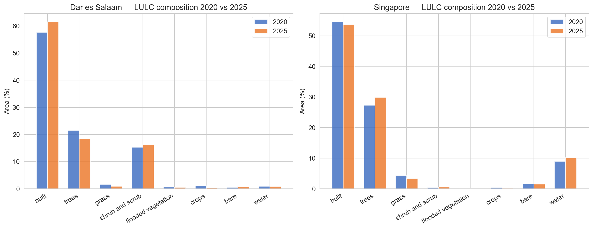 | LULC composition 2020 vs 2025 — both cities |
| 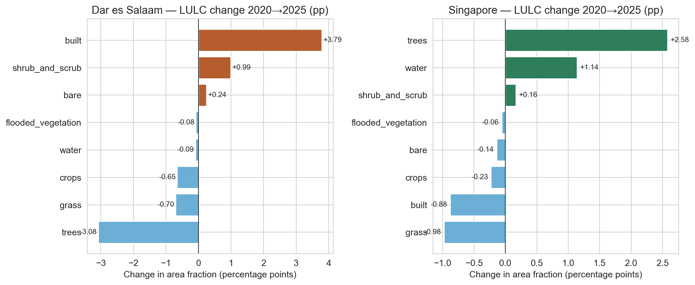 | LULC change 2020→2025 — which classes grew and shrank |
| 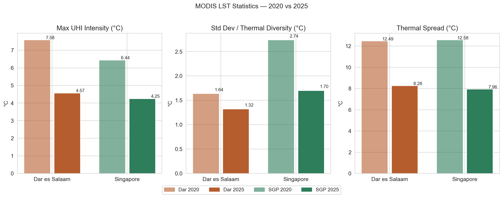 | MODIS LST statistics — Max UHI, Std Dev, Thermal Spread |
| 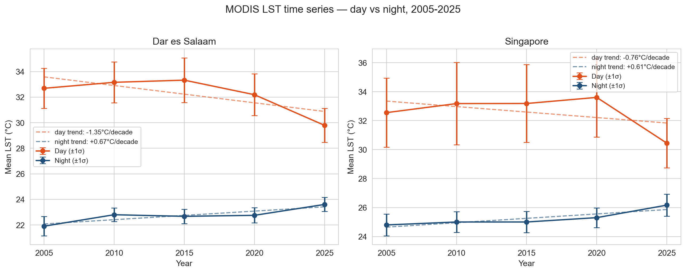 | 20-year MODIS LST day + night trends, 2005–2025 |
| 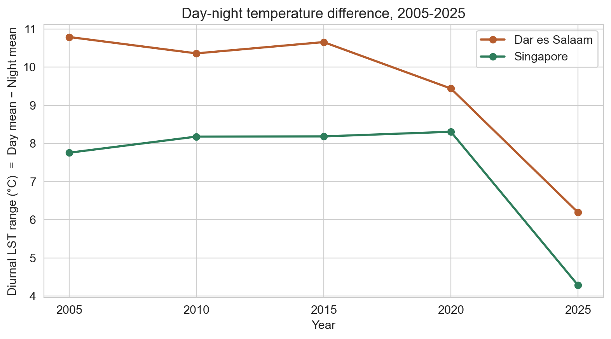 | Shrinking day-night gap — cities losing overnight cooling |
| 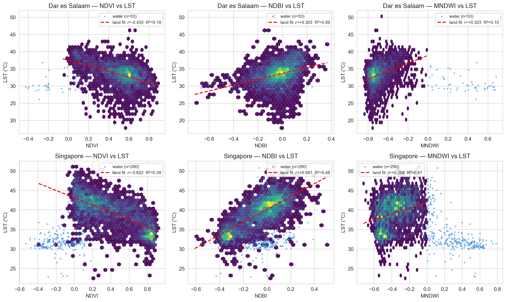 | NDVI / NDBI / MNDWI vs LST correlation scatter plots |
| 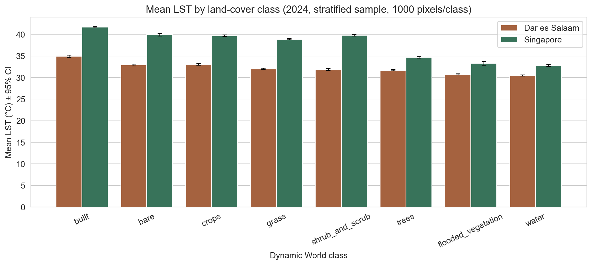 | Mean LST per Dynamic World land-cover class |
| 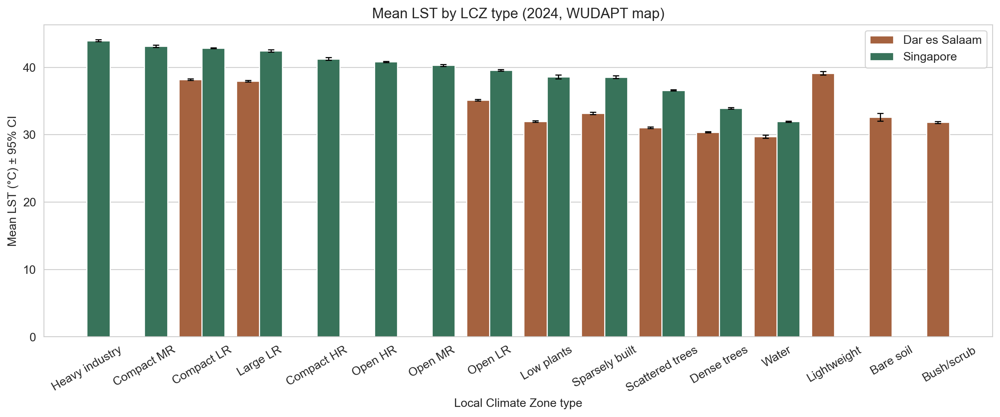 | Mean LST per Local Climate Zone type, both cities |
| 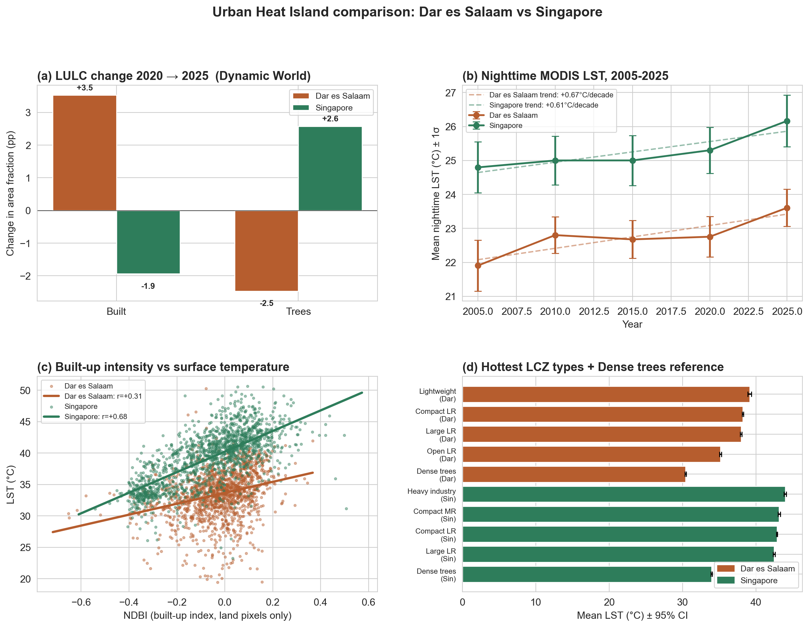 | Full project synthesis: LULC, trend, correlation, LCZ |
| 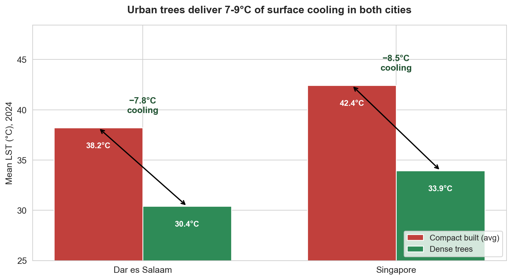 | Urban tree cooling benefit: −7.8°C (Dar), −8.5°C (SGP) |
| 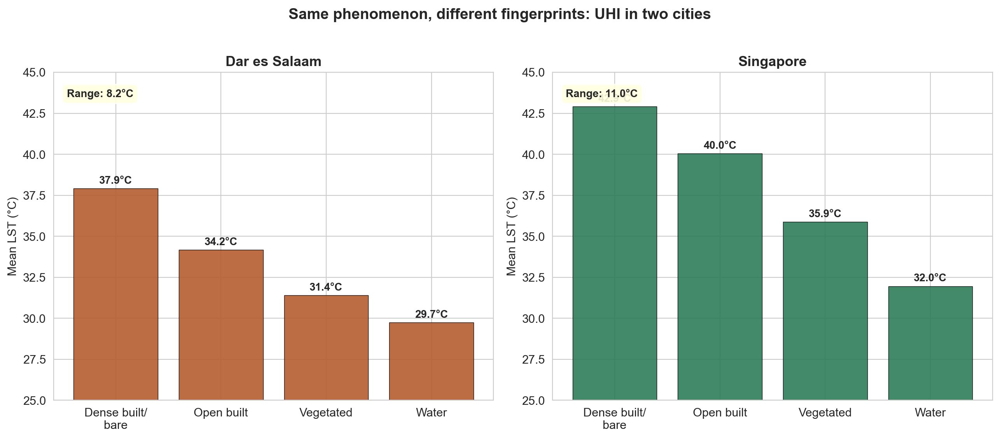 | Same phenomenon, different fingerprints |
| 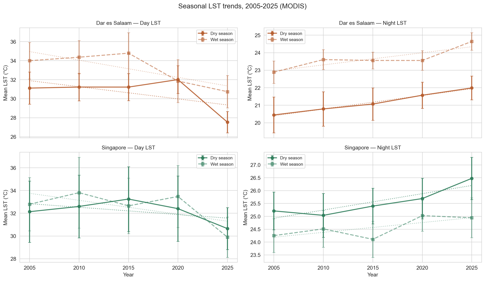 | Seasonal LST trends — dry vs wet, 2005–2025 |
| 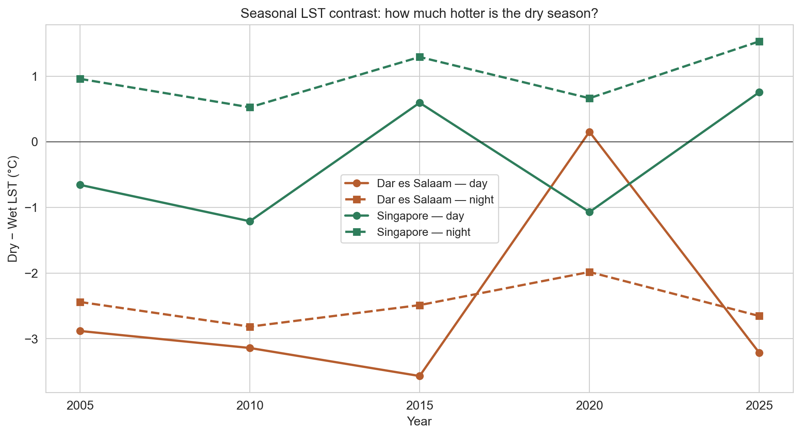 | Dry minus wet LST — how much hotter is each season? |
| 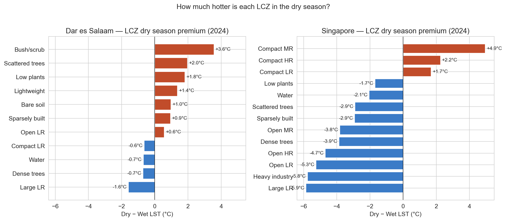 | LCZ seasonal contrast — which urban forms amplify most? |
| 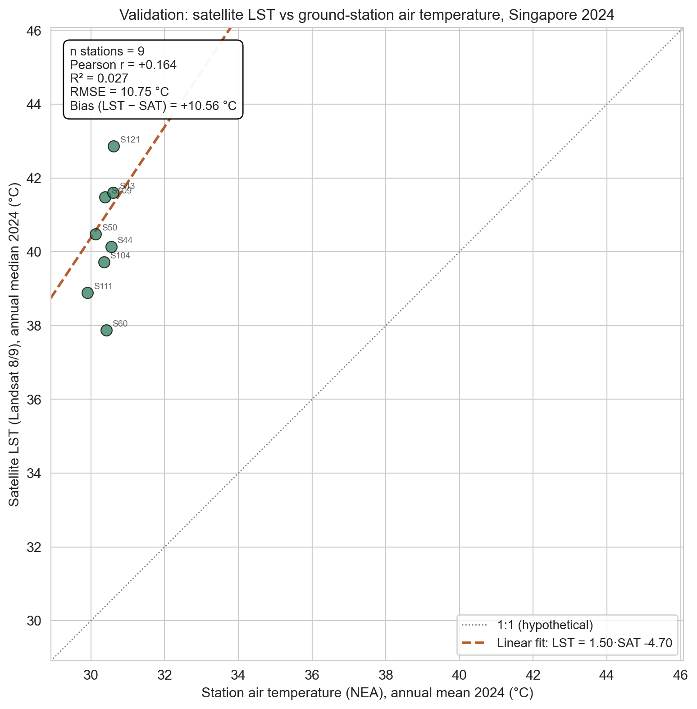 | Singapore NEA station vs Landsat LST validation |

### Headline Numbers at a Glance

```
━━━━━━━━━━━━━━━━━━━━━━━━━━━━━━━━━━━━━━━━━━━━━━━━━━━━━━━━━━━━━━━━━
                        DAR ES SALAAM        SINGAPORE
━━━━━━━━━━━━━━━━━━━━━━━━━━━━━━━━━━━━━━━━━━━━━━━━━━━━━━━━━━━━━━━━━
Built-up 2020→2025      57.73% → 61.52%     54.57% → 53.69%
Tree cover 2020→2025    21.56% → 18.48%     27.37% → 29.95%
Built change            +3.79pp             −0.88pp
Tree change             −3.08pp             +2.58pp
Max UHI intensity 2020  7.58°C              6.44°C
Std dev (diversity)     1.64°C              2.74°C
Night warming trend     +0.77°C/decade *    +0.64°C/decade *
Hottest LCZ             Lightweight LR      Heavy industry
                        (informal settl.)   (Jurong Island)
Hottest LST             39.1°C              44.0°C
Intra-city range        9.4°C               12.0°C
Tree cooling benefit    −7.8°C              −8.5°C
NDBI–LST r (land)       +0.31               +0.68
LST–SAT bias            —                   +10.56°C
━━━━━━━━━━━━━━━━━━━━━━━━━━━━━━━━━━━━━━━━━━━━━━━━━━━━━━━━━━━━━━━━━
* p < 0.05, dry-season night LST, 2005–2025
```

---

## Conclusion

Both cities show consistent nighttime warming of +0.67°C/decade (Dar es Salaam) and +0.61°C/decade (Singapore) over 2005–2025, confirming Urban Heat Island intensification regardless of opposite land-use trajectories — Dar expanding built-up area by 3.79pp while losing 3.08pp of tree cover, Singapore doing the reverse. Note that 2025 daytime LST values appear suppressed due to La Niña 2024–25 conditions which temporarily reduced surface temperatures globally; nighttime trends remain the robust thermal signal. Spatially, Dar's informal settlements (LCZ 7) are its hottest zone at 39.1°C, concentrating heat burden on the most vulnerable, while Singapore's heavy industry peaks at 44.0°C but is separated from residential areas. Across both cities, dense urban tree cover delivers 7–9°C of surface cooling — a consistent, transferable, and evidence-based policy target for tropical urban climate adaptation.

---

## Limitations

1. **Five temporal snapshots** — MODIS trends fitted on 5 points (2005, 2010, 2015, 2020, 2025). Annual data would give more robust estimates.
2. **La Niña 2024–25 artifact** — 2025 daytime LST anomalously low. Night trends unaffected and are the primary result.
3. **Resolution mismatch** — MODIS (1km) for temporal trends; Landsat (30m) for spatial correlations. Not directly comparable pixel-to-pixel.
4. **NDBI calibration** — Designed for Global North cities. Weaker performance in Dar (r = +0.31 vs +0.68) reflects informal settlement materials not captured by the index.
5. **Dar validation not possible** — Tanzania Meteorological Authority data not freely accessible. Validation is Singapore-only.
6. **WUDAPT vintage** — Global LCZ map reflects ~2020–22 urban form. Rapid Dar expansion since may not be fully captured.
7. **Daytime overpass only** — MODIS Terra crosses at ~10:30am. Values represent morning heating, not daily maxima.

---

## Team

This project was developed as part of the **Women + Girls in GIS Mentorship Programme** Legacy Project.

| Member | Role | City focus |
|---|---|---|
| Monalisa | LST maps (2020 & 2025) | Both cities |
| Aulia | LULC maps (2020 & 2025) | Singapore |
| Christa | Extended analysis (notebooks 03–08) | Both cities |

**Mentor:** [Mentor name]  
**Programme:** Women + Girls in GIS, Cohort [Year]

---

## References

Brown, C. F., Brumby, S. P., Guzder-Williams, B., Naoise, T., Hyde, S. B., Reymondin, L., Herament, M., Szantoi, Z., Brugger, N., & Newcome, J. (2022). Dynamic World, near real-time global 10 m land use land cover mapping. *Scientific Data*, *9*, 251. https://doi.org/10.1038/s41597-022-01307-4

Demuzere, M., Kittner, J., Martilli, A., Mills, G., Moede, C., Stewart, I. D., van Vliet, J., & Bechtel, B. (2022). A global map of local climate zones to support earth system modelling and urban-scale environmental science. *Earth System Science Data*, *14*(8), 3835–3873. https://doi.org/10.5194/essd-14-3835-2022

Siswanto, S., Nuryanto, D. E., Ferdiansyah, M. R., Prastiwi, A. D., Dewi, O. C., Gamal, A., & Dimyati, M. (2023). Spatio-temporal characteristics of urban heat island of Jakarta metropolitan. *Remote Sensing Applications: Society and Environment*, *32*, 101062. https://doi.org/10.1016/j.rsase.2023.101062

Stewart, I. D., & Oke, T. R. (2012). Local climate zones for urban temperature studies. *Bulletin of the American Meteorological Society*, *93*(12), 1879–1900. https://doi.org/10.1175/BAMS-D-11-00019.1

Wan, Z., Hook, S., & Hulley, G. (2021). *MODIS/Terra Land Surface Temperature/Emissivity 8-Day L3 Global 1km SIN Grid V061* [Dataset]. NASA EOSDIS Land Processes DAAC. https://doi.org/10.5067/MODIS/MOD11A2.061

Xu, H. (2006). Modification of normalised difference water index (NDWI) to enhance open water features in remotely sensed imagery. *International Journal of Remote Sensing*, *27*(14), 3025–3033. https://doi.org/10.1080/01431160600589179

Yu, X., Guo, X., & Wu, Z. (2014). Land surface temperature retrieval from Landsat 8 TIRS. *Remote Sensing*, *6*(10), 9829–9852. https://doi.org/10.3390/rs6109829

---

## Acknowledgements

This project was developed as a legacy project for the **Women + Girls in GIS Mentorship Programme**. All satellite data accessed via **Google Earth Engine** under the non-commercial research licence. Singapore air temperature data obtained from the **Singapore National Environment Agency** via the public data.gov.sg API. The authors thank the WUDAPT community for the open-access global LCZ dataset.

---

## License

This project is licensed under the MIT License — see [LICENSE](LICENSE) for details.

Data licences: MODIS (NASA open data) · Landsat (USGS open data) · Dynamic World (CC BY 4.0) · WUDAPT LCZ map (CC BY 4.0) · Singapore NEA data (Singapore Open Data Licence v1.0)

---

*Built with Google Earth Engine · geemap · Landsat · MODIS · Dynamic World · WUDAPT*
